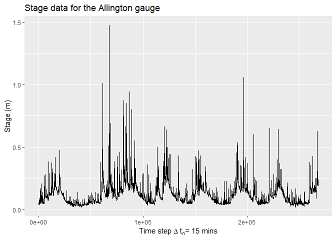

# Introduction to R

R is an open source programming language and environment for statistical computing and graphics.

It provides a wide variety of statistical techniques (e.g. linear and non-linear modelling, statistical tests, time-series analysis, etc.) that’s why its often used by Analysts, Statisticians and Data Scientists.

Let's get started on using some code

# Inputting data

When we start to learn any programming languages we follow a tradition to begin Hello World! as our first basic program 


```r
print("Hello World!")
```

```
## [1] "Hello World!"
```

However, R has an inbuilt <span style="background-color: #E0E0E0">print()</span> function. Let's put a string into the console.

```r
"Hello E&R, you are now using R"
```

```
## [1] "Hello E&R, you are now using R"
```

This can be very handy if you wish to do some basic maths.

```r
1 + 1
2 * 2
3 + 2 * 5
5 + 5; 1 + 1 # Using ; you can execute multiple lines on one line
```

You can include comments with a "#", you can comment out text blocks with ctrl + shift + c


```r
# 1 + 1
# 2 * 2
# 3 + 2 * 5
# 5 + 5; 1 + 1 # Using ; you can execute multiple lines on one line
```

# Logical and Boolean operators

In R Logical and Boolean operator are written as TRUE or FALSE. While they can be abbreviated to T and F, this is not considered best practise.

They are a special R data type, they are not strings, they don’t require ’’ or "" around them.

They also have numerical values behind them - TRUE is 1 and FALSE is 0. This allows them to have maths applied to them


```r
TRUE
```

```
## [1] TRUE
```

```r
TRUE + TRUE
```

```
## [1] 2
```

```r
FALSE * 20
```

```
## [1] 0
```

Common logical operators include;

**<**	Less Than<br /> 
**<=**	Less Than or Equal To<br /> 
**>**	Greater Than<br /> 
**>=**	Greater Than or Equal To<br /> 
**==**	Equal To<br /> 
**!=**	Not Equal To<br /> 
**%in%**	Membership<br /> 
**|**	Or<br /> 
**&**	And

We are far more likely to see logical values when we work with logical (or conditional) operators, for example; to perform comparisons and checks. Later on you will see how we can use them to filter data and in another session you will see their application in conditional loops.

Try running these;

```r
5 != 6
5 + 1 != 6
6 >= 7
6 < 7
6 + 1 == 8
6 & 7 == 8
TRUE == 1
```

# Applying Functions

A function is a set of statements organized together to perform a specific task. R has a large number of in-built functions and the user can create their own functions.

## Functions {.tabset}
Functions are displayed as a word followed by a parenthesis. The functions statements are applied to data sitting in the parenthesis. As you carried out above, the <span style="background-color: #E0E0E0">print()</span> function is one of the most basic functions you will use in R. In the following tabs are some basic mathamatical functions.

### Print

```r
print("Hello World!")
```
### Square roots

```r
sqrt(16)
```

```
## [1] 4
```

### Exponents

```r
exp(10)
```

```
## [1] 22026.47
```

### Logs

```r
log10(10)
```

```
## [1] 1
```

### Rounding a number

```r
round(4.5555)
```

```
## [1] 5
```

## Function arguments {.tabset}
You can specify how a function works through applying an argument. We might want to round a number to a set number of decimal places, in the round() function there are arguments to specify this

### Round 3DP

```r
round(4.5555, digits = 3)
```

```
## [1] 4.556
```
### Round 1DP

```r
round(4.5555, digits = 2)
```

```
## [1] 4.56
```
### Round 0DP

```r
round(4.5555, digits = 0)
```

```
## [1] 5
```

## How to find further information
To view the arguments that can be applied to a function

```r
?round()
```

# Data types

## Number Types

R is host to thousands of built-in functions, as you learn R you will be expopsed to many and even start making your own. However we need to understand the types of number that can feed into these functions, results can vary particularly as your tasks become more advanced.

Double (dbl) or Numeric (num)  
Integers (int)

A Double is the default R will use, it will treat all numbers you use as double unless you give it an explicit reason to think otherwise. Any number with or without a decimal place will be treated as double unless treated otherwise.
Integers are whole numbers with no decimal place. They are often denoted in R by an L at the end of the number.
The main difference between the 2 is how they are treated in the computers memory, not somthing you have to worry about.

Using the <span style="background-color: #E0E0E0">typeof()</span> typeof() function will reveal the number type.
 

```r
typeof(1500)
typeof(1500L)
```

## Classes

Often data might not be the ideal class.

To check the class of your data apply the <span style="background-color: #E0E0E0">class()</span> function;

```r
class("25")
```

```
## [1] "character"
```

```r
class(4.5555)
```

```
## [1] "numeric"
```

## Converting

The as. group of functions will convert data into a desired class/type.


```r
as.numeric("25")
as.integer(4.5555)
```

Try typing <span style="background-color: #E0E0E0">as.</span> followed by pressing the <span style="background-color: #E0E0E0">tab</span> key to view the different conversions available in R.

# Objects
## Assigning names to objects

Unlike other languages, R doesn't allow you direct access to the computers memory. Instead, it provides a lot of specialised structures called objects. Everything in R is an object, these can be given names to identify them as variables. 

Using an operator you can assign a value to an object In R you can use **<-** or **=**, however it is best practice to use **<-**

Following a recent visit to the vet, I want to assign Pippa's weight to a vector called **pippa_weight**

```r
pippa_weight <- 26.5 #kg
```

To view the data call the variable. R will treat this as <span style="background-color: #E0E0E0">print(pippa_weight)</span>

```r
pippa_weight
```

## Calculations with objects
Suppose we wanted to convert Pippa's weight to lb.

In R vectors can be included in mathematical operations

```r
pippa_weight_lb <- pippa_weight * 2.2
pippa_weight_lb
```

```
## [1] 58.3
```

## Correcting data
If I'd made a mistake on inputting the initial weight, you can correct it directly by overwriting (or reassigning) it.


```r
pippa_weight <- 25.5 
pippa_weight
```

```
## [1] 25.5
```

This has corrected the **pippa_weight** object, however **pippa_weight_lb** will still retain the old information - this is one way in which R treats data differently to excel.


```r
pippa_weight_lb
```

## Removing objects
As this variable is now wrong we can either correct it by rerunning the conversion above or remove it via;

```r
rm(pippa_weight_lb)
```

# Vectors

R has a dozen or so basic data types, but the ones that you’ll be dealing with most often are vectors. Roughly, there are two different kinds: atomic vectors and lists (generic vectors). We will cover lists in a later session.

Vectors are probably simplest and the most used commonly used data structure in R. They can be considered collections of values that are all of the same type.

Vectors are particularly important as most of the functions you will write will work with vectors. As all elements in a vector have to be of the same type we therefore have different types of vectors. These are:

**Logical vector** - contains only logical values.<br />
**Numerical vector** - contains only numerical values.<br />
**Character vector** - contains only character values.<br />
There are more types of vectors, but for the purpose of our learning these are sufficient.

## c()

You are not confined to one data point in a vector. If you wish to manually assign multiple data points to a vector, you will require the use of the  <span style="background-color: #E0E0E0">c()</span> function.

I have a record of all of Pippa's weights from various vet appointments. Using the <span style="background-color: #E0E0E0">c()</span> function we can assign them all to a vector and plot them.


```r
pippa_weights <- c(6.5, 7.6, 8.9, 12, 15.8, 21, 22, 23.4, 25.5, 26)
```

## Weights {.tabset}
### Vector

Vector output of Pippa's weights


```r
pippa_weights
```

```
##  [1]  6.5  7.6  8.9 12.0 15.8 21.0 22.0 23.4 25.5 26.0
```

### Plot

A basic line plot of Pippa's weights

```r
par(mar = c(4, 4, .5, .1))
plot(pippa_weights, type ="b",
     xlab = "Vet visit", ylab = "Pippa Weight (kg)")
```

<!-- -->

You aren't limited to just numeric data in vectors.


```r
SD_team <- c("Alan", "Jackie", "Leon", "Rob", "Ron", "Harriet", "Mike", "Jo", "Barrie")
SD_team
```

```
## [1] "Alan"    "Jackie"  "Leon"    "Rob"     "Ron"     "Harriet" "Mike"   
## [8] "Jo"      "Barrie"
```

The <span style="background-color: #E0E0E0">str()</span> function can provide useful information on the type of data contained in a vector


```r
str(pippa_weights)
```

```
##  num [1:10] 6.5 7.6 8.9 12 15.8 21 22 23.4 25.5 26
```

```r
str(SD_team)
```

```
##  chr [1:9] "Alan" "Jackie" "Leon" "Rob" "Ron" "Harriet" "Mike" "Jo" ...
```

## Vector calculations

This is where the benefits of R over excel start to become apparent. No more clicking and dragging equations, no more ambiguity on what is and isn't included.

Lets generate some sequences of data using different methods.

```r
sample1 <- seq(from = 1, to = 100, length.out = 100)
sample2 <- 1:100
```
Both of the methods will provide a vector of 1 to 100 in 100 steps. Let's apply some basic operators to the 2 vectors

## Operators {.tabset}
### Addition

Vector addition

```r
addition <- sample1 + sample2
addition
```

```
##   [1]   2   4   6   8  10  12  14  16  18  20  22  24  26  28  30  32  34  36
##  [19]  38  40  42  44  46  48  50  52  54  56  58  60  62  64  66  68  70  72
##  [37]  74  76  78  80  82  84  86  88  90  92  94  96  98 100 102 104 106 108
##  [55] 110 112 114 116 118 120 122 124 126 128 130 132 134 136 138 140 142 144
##  [73] 146 148 150 152 154 156 158 160 162 164 166 168 170 172 174 176 178 180
##  [91] 182 184 186 188 190 192 194 196 198 200
```

### Multiplication

Vector multiplication

```r
multiply <- sample1 * sample2
multiply
```

```
##   [1]     1     4     9    16    25    36    49    64    81   100   121   144
##  [13]   169   196   225   256   289   324   361   400   441   484   529   576
##  [25]   625   676   729   784   841   900   961  1024  1089  1156  1225  1296
##  [37]  1369  1444  1521  1600  1681  1764  1849  1936  2025  2116  2209  2304
##  [49]  2401  2500  2601  2704  2809  2916  3025  3136  3249  3364  3481  3600
##  [61]  3721  3844  3969  4096  4225  4356  4489  4624  4761  4900  5041  5184
##  [73]  5329  5476  5625  5776  5929  6084  6241  6400  6561  6724  6889  7056
##  [85]  7225  7396  7569  7744  7921  8100  8281  8464  8649  8836  9025  9216
##  [97]  9409  9604  9801 10000
```

### Sine

Sine wave plus sample

```r
sine <- sin(sample1) + sample2 
sine
```

```
##   [1]  1.841471  2.909297  3.141120  3.243198  4.041076  5.720585  7.656987
##   [8]  8.989358  9.412118  9.455979 10.000010 11.463427 13.420167 14.990607
##  [15] 15.650288 15.712097 16.038603 17.249013 19.149877 20.912945 21.836656
##  [22] 21.991149 22.153780 23.094422 24.867648 26.762558 27.956376 28.270906
##  [29] 28.336366 29.011968 30.595962 32.551427 33.999912 34.529083 34.571817
##  [36] 35.008221 36.356462 38.296369 39.963795 40.745113 40.841377 41.083478
##  [43] 42.168225 44.017702 45.850904 46.901788 47.123573 47.231745 48.046247
##  [50] 49.737625 51.670229 52.986628 53.395925 53.441211 54.000245 55.478449
##  [57] 57.436165 58.992873 59.636738 59.695189 60.033882 61.260819 63.167356
##  [64] 64.920026 65.826829 65.973449 66.144480 67.102072 68.885215 70.773891
##  [71] 71.951055 72.253823 72.323228 73.014854 74.612218 76.566108 77.999520
##  [78] 78.513978 78.555887 79.006111 80.370112 82.313229 83.968364 84.733190
##  [85] 84.823924 85.076542 86.178182 88.035398 89.860069 90.893997 91.105988
##  [92] 91.220534 92.051718 93.754748 95.683262 96.983588 97.379608 97.426618
##  [99] 98.000793 99.493634
```

### Plot

A basic line plot of Pippa's weights

```r
par(mar = c(4, 4, .5, .1))
plot(addition, type ="l")
lines(multiply, type = "l", lty = 2)
lines(sine, type = "l", lty = 3)
```

<!-- -->

## Calculations in R and Python {.tabset}

If we wanted to double the size of the sample1 vector;

### R

Multiply sample1 by 2

```r
doubled <- sample1 * 2
doubled
```

```
##   [1]   2   4   6   8  10  12  14  16  18  20  22  24  26  28  30  32  34  36
##  [19]  38  40  42  44  46  48  50  52  54  56  58  60  62  64  66  68  70  72
##  [37]  74  76  78  80  82  84  86  88  90  92  94  96  98 100 102 104 106 108
##  [55] 110 112 114 116 118 120 122 124 126 128 130 132 134 136 138 140 142 144
##  [73] 146 148 150 152 154 156 158 160 162 164 166 168 170 172 174 176 178 180
##  [91] 182 184 186 188 190 192 194 196 198 200
```

### Old Python

In Python, to carry out these calculation you have to creat a for loop that cycles through each row of the vector.


```r
doubled = []
for x in sample1:
  doubled.append(2 * x)
print(doubled)
```

### Modern Python

Modern Python encourages programmers to use list comprehensions instead of loops, i.e., to write:

```r
doubled = [2 * x for x in sample1]
print(doubled)
```

### NumPy
If sample1 is a NumPy array, we can shorten this to 2 * original. R provides this capability in the language itself:

```r
doubled <- 2 * sample1
doubled
```

## Indexing of vectors

Sometimes you might need to see what the value at a specific place within a vector. Using <span style="background-color: #E0E0E0">[]</span> will pull a value out from a specified place.

> R indexes from 1, most other languages index from 0

In the below examples we wish to return the first, second through to fifth and the first, fifth, and eigth members of the SD team.


```r
SD_team[1]
```

```
## [1] "Alan"
```

```r
SD_team[2:5]
```

```
## [1] "Jackie" "Leon"   "Rob"    "Ron"
```

```r
SD_team[c(1,5,8)]
```

```
## [1] "Alan" "Ron"  "Jo"
```

## Editing values in a vector

You may have noticed that the SD forecasting team does not have a Ron or Barrie. These values are easily corrected.

Here we select the fifth and ninth positions in the vector and reassign them with Jon and Carrie.


```r
SD_team[c(5,9)] <- c("Jon","Carrie")
SD_team
```

```
## [1] "Alan"    "Jackie"  "Leon"    "Rob"     "Jon"     "Harriet" "Mike"   
## [8] "Jo"      "Carrie"
```


We might often be faced with large quantities of vectors, this is not ideal. By combing them into a *data frame* we can organise them. To do this we can use the <span style="background-color: #E0E0E0">data.frame()</span> function.


```r
table <- data.frame(pippa_weight, SD_team)
```

Any ideas why this hasn't worked?

Previously when making collating Pippa's weights, I made an error. The 9th vet visit was a typo. Let's remove it.


```r
pippa_weight <- pippa_weight[-9]
pippa_weight
```

```
## [1] 25.5
```


Let's try the data frame again

```r
table <- data.frame(pippa_weight, SD_team)
table
```

```
##   pippa_weight SD_team
## 1         25.5    Alan
## 2         25.5  Jackie
## 3         25.5    Leon
## 4         25.5     Rob
## 5         25.5     Jon
## 6         25.5 Harriet
## 7         25.5    Mike
## 8         25.5      Jo
## 9         25.5  Carrie
```


# Moving with the times
## Tibbles

> Data frames are so 2018

There are now alternatives to data frames. Tibbles have reconciled some of the behind the scenes problems with data frames that aren't really required for more modern computing. It sits within a package though called tibble. This package is part of a group of packages called tidyverse, these need to be installed if we want to use them.


```r
install.packages("tidyverse")
```

To load a package use


```r
library(tidyverse)
```

To create a tibble we will use the <span style="background-color: #E0E0E0">tibble()</span> function. 

> When calling a function it is good pactice to specify the package that it's from. In this case it is the tibble package, this can be shown as tibble::


```r
data_tibble <- tibble::tibble(pippa_weight, SD_team)
data_tibble
```

```
## # A tibble: 9 x 2
##   pippa_weight SD_team
##          <dbl> <chr>  
## 1         25.5 Alan   
## 2         25.5 Jackie 
## 3         25.5 Leon   
## 4         25.5 Rob    
## 5         25.5 Jon    
## 6         25.5 Harriet
## 7         25.5 Mike   
## 8         25.5 Jo     
## 9         25.5 Carrie
```

## Getting data from tibbles

Retrieving data from tibbles is identical to that of data frames.

To retrieve a column we can use the $ operator.


```r
data_tibble$pippa_weight
```

```
## [1] 25.5 25.5 25.5 25.5 25.5 25.5 25.5 25.5 25.5
```

You can also use indexes like earlier. Only this time there is an extra dimension.

> <span style="background-color: #E0E0E0">data_tibble[*row, column*]</span> 

If we wish to retrieve row 2 from column 2.


```r
data_tibble[2,2]
```

```
## # A tibble: 1 x 1
##   SD_team
##   <chr>  
## 1 Jackie
```

Indexes can have a blank element. In this case we wish to retriev row 4.


```r
data_tibble[4,]
```

```
## # A tibble: 1 x 2
##   pippa_weight SD_team
##          <dbl> <chr>  
## 1         25.5 Rob
```

# Loading and exporting data into R
## Working Directories
Before we start loading files we need to check where the working directory is located. This is the default location R loads from or exports to.


```r
getwd()
```

It's often useful to change this using the <span style="background-color: #E0E0E0">setwd()</span> function.

In Windows the file paths use **\**, as this has other meanings in R you have to change them to **/**

> <span style="background-color: #E0E0E0">setwd("insert/file/path")</span>


```r
setwd("C:/Users/jpayne05/OneDrive - Defra/R")
```

## Reading in data

With base R you can load a csv with <span style="background-color: #E0E0E0">read.csv("file path and name", header = TRUE/FALSE)</span>

However, the tidyverse has a package called readr that performs better and gives more options.

> <span style="background-color: #E0E0E0">readr::read_csv(file_path)</span>

Assuming you have saved the Allington file into your working directory you can load it with;


```r
allington <- readr::read_csv("Allington.csv")
```

```
## Rows: 267936 Columns: 3
```

```
## -- Column specification --------------------------------------------------------
## Delimiter: ","
## chr (1): Time_stamp
## dbl (2): Value, mAoD
```

```
## 
## i Use `spec()` to retrieve the full column specification for this data.
## i Specify the column types or set `show_col_types = FALSE` to quiet this message.
```

Using the <span style="background-color: #E0E0E0">View()</span> function you can view the data in a separate window.


```r
View(allington)
```

## readxl
There is a package called readxl that loads directly from an xls or xlsx file. With this you can load data from different worksheets. We won't be using it in this session but will in the future.

For a function list view the weblinks provided in;


```r
?readxl
```

## Exporting data

We will cover exporting in a later session but for now here is how it can be done.

> <span style="background-color: #E0E0E0">readr::write_csv(dataframe/tibble, path = "../Data/test.csv") </span>

## Non standard data

One of R's largest strengths is that data can be pulled from many sources

SQLite databases - important for forecasting
GET requests - pull data from APIs, JSON, HTML, PHP, XML
Data mining - how many tweets contain "I love flooding", pulling data from websites *etc*.

These will be covered at a later date. For now lets see how many page views the R wikipedia page has had.

This might all look confusing but it will make sense soon.


```r
library(pageviews)
library(ggplot2)
res <- article_pageviews(project = "en.wikipedia",
                                    article = "R_(programming_language)",
                                   start = "2020010100", end = "2022010100")

# Fiddle with the string to get it into proper format for forming a date.
# The regular expression comes from those kind folks at stackoverflow: http://bit.ly/1RKC9iQ
date <- gsub('^(.{7})(.*)$', '\\1-\\2', gsub('^(.{4})(.*)$', '\\1-\\2', res$timestamp))

ggplot(res, aes(date, views)) + geom_line() +
                 geom_point(colour="red",size = 0.5) +
                 xlab("2015") + ylab("Daily Views") +
                 ggtitle("Wikipedia article: R (programming language)")
```

<!-- -->


## Inspecting data

Now we have some data loaded, we should inspect it. though there are base R tools for this, there is a package within the tidyverse called dplyrwhich has some useful tools to make this easier.


```r
library(dplyr)
```

```
## 
## Attaching package: 'dplyr'
```

```
## The following objects are masked from 'package:stats':
## 
##     filter, lag
```

```
## The following objects are masked from 'package:base':
## 
##     intersect, setdiff, setequal, union
```

Here are some useful functions, those loaded from dplyr are denoted as dplyr::


```r
str(allington) # Structure of the table
dplyr::glimpse(allington)  # Similar to str - from dplyr package
dplyr::sample_n(allington, size = 5) # select a random sample from out data of a given `size`
View(allington)  # Pops file into a Viewer.
head(allington) # Top of the table
tail(allington, n = 10) # Bottom of the table
dim(allington) # Dimensions of the table [rows, columns]
nrow(allington) # Number of rows
ncol(allington) # Number of columns
names(allington) # Names of columns
summary(allington) # summary statistics for data
unique(allington) # Shows unique values, better applied on categorical data
```

# Data manipulation

Most of your time when analysing data is spent manipulating it into the required format for analysis.

The Starwars data set from the dplyr package should be interesting to play with.

```r
data(starwars)
dplyr::glimpse(starwars)
```

```
## Rows: 87
## Columns: 14
## $ name       <chr> "Luke Skywalker", "C-3PO", "R2-D2", "Darth Vader", "Leia Or~
## $ height     <int> 172, 167, 96, 202, 150, 178, 165, 97, 183, 182, 188, 180, 2~
## $ mass       <dbl> 77.0, 75.0, 32.0, 136.0, 49.0, 120.0, 75.0, 32.0, 84.0, 77.~
## $ hair_color <chr> "blond", NA, NA, "none", "brown", "brown, grey", "brown", N~
## $ skin_color <chr> "fair", "gold", "white, blue", "white", "light", "light", "~
## $ eye_color  <chr> "blue", "yellow", "red", "yellow", "brown", "blue", "blue",~
## $ birth_year <dbl> 19.0, 112.0, 33.0, 41.9, 19.0, 52.0, 47.0, NA, 24.0, 57.0, ~
## $ sex        <chr> "male", "none", "none", "male", "female", "male", "female",~
## $ gender     <chr> "masculine", "masculine", "masculine", "masculine", "femini~
## $ homeworld  <chr> "Tatooine", "Tatooine", "Naboo", "Tatooine", "Alderaan", "T~
## $ species    <chr> "Human", "Droid", "Droid", "Human", "Human", "Human", "Huma~
## $ films      <list> <"The Empire Strikes Back", "Revenge of the Sith", "Return~
## $ vehicles   <list> <"Snowspeeder", "Imperial Speeder Bike">, <>, <>, <>, "Imp~
## $ starships  <list> <"X-wing", "Imperial shuttle">, <>, <>, "TIE Advanced x1",~
```

```r
head(starwars)
```

```
## # A tibble: 6 x 14
##   name     height  mass hair_color  skin_color eye_color birth_year sex   gender
##   <chr>     <int> <dbl> <chr>       <chr>      <chr>          <dbl> <chr> <chr> 
## 1 Luke Sk~    172    77 blond       fair       blue            19   male  mascu~
## 2 C-3PO       167    75 <NA>        gold       yellow         112   none  mascu~
## 3 R2-D2        96    32 <NA>        white, bl~ red             33   none  mascu~
## 4 Darth V~    202   136 none        white      yellow          41.9 male  mascu~
## 5 Leia Or~    150    49 brown       light      brown           19   fema~ femin~
## 6 Owen La~    178   120 brown, grey light      blue            52   male  mascu~
## # ... with 5 more variables: homeworld <chr>, species <chr>, films <list>,
## #   vehicles <list>, starships <list>
```

## Sorting data

The dplyr package has an <span style="background-color: #E0E0E0">dplyr::arrange()</span>() function, this defaults to ascending. 


```r
height_ascending <- dplyr::arrange(.data = starwars,
                                   height)
head(height_ascending)
```

```
## # A tibble: 6 x 14
##   name      height  mass hair_color skin_color eye_color birth_year sex   gender
##   <chr>      <int> <dbl> <chr>      <chr>      <chr>          <dbl> <chr> <chr> 
## 1 Yoda          66    17 white      green      brown            896 male  mascu~
## 2 Ratts Ty~     79    15 none       grey, blue unknown           NA male  mascu~
## 3 Wicket S~     88    20 brown      brown      brown              8 male  mascu~
## 4 Dud Bolt      94    45 none       blue, grey yellow            NA male  mascu~
## 5 R2-D2         96    32 <NA>       white, bl~ red               33 none  mascu~
## 6 R4-P17        96    NA none       silver, r~ red, blue         NA none  femin~
## # ... with 5 more variables: homeworld <chr>, species <chr>, films <list>,
## #   vehicles <list>, starships <list>
```

To view in descending order we have to nest the <span style="background-color: #E0E0E0">desc()</span> function


```r
height_descending <- dplyr::arrange(.data = starwars,
                                   desc(height))
head(height_descending)
```

```
## # A tibble: 6 x 14
##   name    height  mass hair_color skin_color  eye_color  birth_year sex   gender
##   <chr>    <int> <dbl> <chr>      <chr>       <chr>           <dbl> <chr> <chr> 
## 1 Yarael~    264    NA none       white       yellow             NA male  mascu~
## 2 Tarfful    234   136 brown      brown       blue               NA male  mascu~
## 3 Lama Su    229    88 none       grey        black              NA male  mascu~
## 4 Chewba~    228   112 brown      unknown     blue              200 male  mascu~
## 5 Roos T~    224    82 none       grey        orange             NA male  mascu~
## 6 Grievo~    216   159 none       brown, whi~ green, ye~         NA male  mascu~
## # ... with 5 more variables: homeworld <chr>, species <chr>, films <list>,
## #   vehicles <list>, starships <list>
```

The <span style="background-color: #E0E0E0">dplyr::arrange()</span> function is very flexible, you can sort by multiple components.In this case we'll use height and mass.


```r
two_variables <- dplyr::arrange(.data = starwars,
                                height,
                                mass)
head(two_variables)
```

```
## # A tibble: 6 x 14
##   name      height  mass hair_color skin_color eye_color birth_year sex   gender
##   <chr>      <int> <dbl> <chr>      <chr>      <chr>          <dbl> <chr> <chr> 
## 1 Yoda          66    17 white      green      brown            896 male  mascu~
## 2 Ratts Ty~     79    15 none       grey, blue unknown           NA male  mascu~
## 3 Wicket S~     88    20 brown      brown      brown              8 male  mascu~
## 4 Dud Bolt      94    45 none       blue, grey yellow            NA male  mascu~
## 5 R2-D2         96    32 <NA>       white, bl~ red               33 none  mascu~
## 6 R4-P17        96    NA none       silver, r~ red, blue         NA none  femin~
## # ... with 5 more variables: homeworld <chr>, species <chr>, films <list>,
## #   vehicles <list>, starships <list>
```

## Selecting data {.tabset}

The <span style="background-color: #E0E0E0">dplyr::select()</span> function is also very useful, it give you a lot more flexibility when calling up or removing variables than the $ or [] methods.

### One Variable

One variable

```r
starwars_one_variable <- dplyr::select(.data = starwars, 
                                      name)
head(starwars_one_variable)
```

```
## # A tibble: 6 x 1
##   name          
##   <chr>         
## 1 Luke Skywalker
## 2 C-3PO         
## 3 R2-D2         
## 4 Darth Vader   
## 5 Leia Organa   
## 6 Owen Lars
```

### Three Variables

Columns are specified manually 

```r
starwars_three_variables <- dplyr::select(.data = starwars,
                                       name, 
                                       birth_year,
                                       species)
head(starwars_three_variables)
```

```
## # A tibble: 6 x 3
##   name           birth_year species
##   <chr>               <dbl> <chr>  
## 1 Luke Skywalker       19   Human  
## 2 C-3PO               112   Droid  
## 3 R2-D2                33   Droid  
## 4 Darth Vader          41.9 Human  
## 5 Leia Organa          19   Human  
## 6 Owen Lars            52   Human
```

### Five Variables

This uses a range of columns from name to skin_colour

```r
starwars_five_variables <- dplyr::select(.data = starwars,
                                        name:skin_color)
head(starwars_five_variables)
```

```
## # A tibble: 6 x 5
##   name           height  mass hair_color  skin_color 
##   <chr>           <int> <dbl> <chr>       <chr>      
## 1 Luke Skywalker    172    77 blond       fair       
## 2 C-3PO             167    75 <NA>        gold       
## 3 R2-D2              96    32 <NA>        white, blue
## 4 Darth Vader       202   136 none        white      
## 5 Leia Organa       150    49 brown       light      
## 6 Owen Lars         178   120 brown, grey light
```

### All but three

Select all but films, vehicles and starships

```r
starwars_minus_three <- dplyr::select(.data = starwars,
                                        -films,
                                      -vehicles,
                                      -starships)
head(starwars_minus_three)
```

```
## # A tibble: 6 x 11
##   name     height  mass hair_color  skin_color eye_color birth_year sex   gender
##   <chr>     <int> <dbl> <chr>       <chr>      <chr>          <dbl> <chr> <chr> 
## 1 Luke Sk~    172    77 blond       fair       blue            19   male  mascu~
## 2 C-3PO       167    75 <NA>        gold       yellow         112   none  mascu~
## 3 R2-D2        96    32 <NA>        white, bl~ red             33   none  mascu~
## 4 Darth V~    202   136 none        white      yellow          41.9 male  mascu~
## 5 Leia Or~    150    49 brown       light      brown           19   fema~ femin~
## 6 Owen La~    178   120 brown, grey light      blue            52   male  mascu~
## # ... with 2 more variables: homeworld <chr>, species <chr>
```

```r
# Alternative way to deselect the variables
starwars_minus_three <- dplyr::select(.data = starwars,
                                      c(-films,
                                      -vehicles,
                                      -starships))
head(starwars_minus_three)
```

```
## # A tibble: 6 x 11
##   name     height  mass hair_color  skin_color eye_color birth_year sex   gender
##   <chr>     <int> <dbl> <chr>       <chr>      <chr>          <dbl> <chr> <chr> 
## 1 Luke Sk~    172    77 blond       fair       blue            19   male  mascu~
## 2 C-3PO       167    75 <NA>        gold       yellow         112   none  mascu~
## 3 R2-D2        96    32 <NA>        white, bl~ red             33   none  mascu~
## 4 Darth V~    202   136 none        white      yellow          41.9 male  mascu~
## 5 Leia Or~    150    49 brown       light      brown           19   fema~ femin~
## 6 Owen La~    178   120 brown, grey light      blue            52   male  mascu~
## # ... with 2 more variables: homeworld <chr>, species <chr>
```

### By column number

```r
starwars_number_select <- dplyr::select(.data = starwars,
                                        1:4, 7) 
head(starwars_number_select)
```

```
## # A tibble: 6 x 5
##   name           height  mass hair_color  birth_year
##   <chr>           <int> <dbl> <chr>            <dbl>
## 1 Luke Skywalker    172    77 blond             19  
## 2 C-3PO             167    75 <NA>             112  
## 3 R2-D2              96    32 <NA>              33  
## 4 Darth Vader       202   136 none              41.9
## 5 Leia Organa       150    49 brown             19  
## 6 Owen Lars         178   120 brown, grey       52
```

## Alternative select() criteria

**starts_with(match):** Starts with a prefix.  
**ends_with(match):** Ends with a suffix.  
**contains(match):** Contains a literal string.  
**matches(match):** Matches a regular expression.  
**everything():** Selects all variables.  
**last_col():** gives the last column.  

Similar to the <span style="background-color: #E0E0E0">desc()</span> used earlier, you have to nest these functions. In the below example we will select any variable that has "ar" in its name. 


```r
starwars_criteria_select <- dplyr::select(.data = starwars,
                                        matches("ar")) 
head(starwars_criteria_select)
```

```
## # A tibble: 6 x 2
##   birth_year starships
##        <dbl> <list>   
## 1       19   <chr [2]>
## 2      112   <chr [0]>
## 3       33   <chr [0]>
## 4       41.9 <chr [1]>
## 5       19   <chr [0]>
## 6       52   <chr [0]>
```


## Filtering {.tabset}

The <span style="background-color: #E0E0E0">dplyr::filter()</span> function is used to subset a data frame, retaining all rows that satisfy your conditions. To be retained, the row must produce a value of <span style="background-color: #E0E0E0">TRUE</span>TRUE for all conditions. Note that when a condition evaluates to <span style="background-color: #E0E0E0">NA</span> the row will be dropped, unlike base subsetting with [.

As the final 3 columns in the dataset are lists we will not cover them today, lets remove deselect them for the rest of this study.


```r
starwars <- dplyr::select(.data = starwars,
                                        -films,
                                      -vehicles,
                                      -starships)
```

### One variable filter

With the starwars tibble, lets retrieve all the data from characters with a homeworld of Tatooine.


```r
Tatooine  <- dplyr::filter(.data = starwars, 
                           homeworld == "Tatooine")
head(Tatooine)
```

```
## # A tibble: 6 x 11
##   name     height  mass hair_color  skin_color eye_color birth_year sex   gender
##   <chr>     <int> <dbl> <chr>       <chr>      <chr>          <dbl> <chr> <chr> 
## 1 Luke Sk~    172    77 blond       fair       blue            19   male  mascu~
## 2 C-3PO       167    75 <NA>        gold       yellow         112   none  mascu~
## 3 Darth V~    202   136 none        white      yellow          41.9 male  mascu~
## 4 Owen La~    178   120 brown, grey light      blue            52   male  mascu~
## 5 Beru Wh~    165    75 brown       light      blue            47   fema~ femin~
## 6 R5-D4        97    32 <NA>        white, red red             NA   none  mascu~
## # ... with 2 more variables: homeworld <chr>, species <chr>
```

You can choose different operators on your filters. Let's find the taller characters, the criteria is a height> 183cm (6ft).


```r
tall <- dplyr::filter(.data = starwars, 
              height > 183)
head(tall)
```

```
## # A tibble: 6 x 11
##   name      height  mass hair_color skin_color eye_color birth_year sex   gender
##   <chr>      <int> <dbl> <chr>      <chr>      <chr>          <dbl> <chr> <chr> 
## 1 Darth Va~    202   136 none       white      yellow          41.9 male  mascu~
## 2 Anakin S~    188    84 blond      fair       blue            41.9 male  mascu~
## 3 Chewbacca    228   112 brown      unknown    blue           200   male  mascu~
## 4 IG-88        200   140 none       metal      red             15   none  mascu~
## 5 Bossk        190   113 none       green      red             53   male  mascu~
## 6 Qui-Gon ~    193    89 brown      fair       blue            92   male  mascu~
## # ... with 2 more variables: homeworld <chr>, species <chr>
```

### Two condition filter I

The <span style="background-color: #E0E0E0">dplyr::filter()</span> function can handle multiple criteria.

Here we can combine the 2 previous examples to find the Tall characters from Tatooine.

```r
tall_Tatooine <- dplyr::filter(.data = starwars, 
                      height > 183
                      & homeworld == "Tatooine")
head(tall_Tatooine)
```

```
## # A tibble: 2 x 11
##   name      height  mass hair_color skin_color eye_color birth_year sex   gender
##   <chr>      <int> <dbl> <chr>      <chr>      <chr>          <dbl> <chr> <chr> 
## 1 Darth Va~    202   136 none       white      yellow          41.9 male  mascu~
## 2 Anakin S~    188    84 blond      fair       blue            41.9 male  mascu~
## # ... with 2 more variables: homeworld <chr>, species <chr>
```

### Two condition filter II

Find any character >183cm or they weigh >= 100kg

```r
tall_or_heavy <- dplyr::filter(.data = starwars, 
                               height > 183
                               | mass >=100)
head(tall_or_heavy)
```

```
## # A tibble: 6 x 11
##   name    height  mass hair_color  skin_color eye_color birth_year sex    gender
##   <chr>    <int> <dbl> <chr>       <chr>      <chr>          <dbl> <chr>  <chr> 
## 1 Darth ~    202   136 none        white      yellow          41.9 male   mascu~
## 2 Owen L~    178   120 brown, grey light      blue            52   male   mascu~
## 3 Anakin~    188    84 blond       fair       blue            41.9 male   mascu~
## 4 Chewba~    228   112 brown       unknown    blue           200   male   mascu~
## 5 Jabba ~    175  1358 <NA>        green-tan~ orange         600   herma~ mascu~
## 6 Jek To~    180   110 brown       fair       blue            NA   male   mascu~
## # ... with 2 more variables: homeworld <chr>, species <chr>
```

### Two condition filter III

Find any character who's hewiught is between 80cm and 120cm

```r
height_between <- dplyr::filter(.data = starwars, 
                                between(height, left = 80, 
                                        right = 120))
head(height_between)
```

```
## # A tibble: 6 x 11
##   name      height  mass hair_color skin_color eye_color birth_year sex   gender
##   <chr>      <int> <dbl> <chr>      <chr>      <chr>          <dbl> <chr> <chr> 
## 1 R2-D2         96    32 <NA>       white, bl~ red               33 none  mascu~
## 2 R5-D4         97    32 <NA>       white, red red               NA none  mascu~
## 3 Wicket S~     88    20 brown      brown      brown              8 male  mascu~
## 4 Sebulba      112    40 none       grey, red  orange            NA male  mascu~
## 5 Dud Bolt      94    45 none       blue, grey yellow            NA male  mascu~
## 6 R4-P17        96    NA none       silver, r~ red, blue         NA none  femin~
## # ... with 2 more variables: homeworld <chr>, species <chr>
```

## Mutate {.tabset}

The <span style="background-color: #E0E0E0">dplyr::mutate()</span> function adds new variables and preserves existing ones.

### Adding columns to tibble

Let's see how healthy the characters are by calculating their BMI (Body Mass Index). We can apply mathamatical functions from existing data to calculate the new column.

```r
starwars <- dplyr::mutate(.data = starwars, 
                                bmi = mass/(height/100)^2)

dplyr::glimpse(starwars)
```

```
## Rows: 87
## Columns: 12
## $ name       <chr> "Luke Skywalker", "C-3PO", "R2-D2", "Darth Vader", "Leia Or~
## $ height     <int> 172, 167, 96, 202, 150, 178, 165, 97, 183, 182, 188, 180, 2~
## $ mass       <dbl> 77.0, 75.0, 32.0, 136.0, 49.0, 120.0, 75.0, 32.0, 84.0, 77.~
## $ hair_color <chr> "blond", NA, NA, "none", "brown", "brown, grey", "brown", N~
## $ skin_color <chr> "fair", "gold", "white, blue", "white", "light", "light", "~
## $ eye_color  <chr> "blue", "yellow", "red", "yellow", "brown", "blue", "blue",~
## $ birth_year <dbl> 19.0, 112.0, 33.0, 41.9, 19.0, 52.0, 47.0, NA, 24.0, 57.0, ~
## $ sex        <chr> "male", "none", "none", "male", "female", "male", "female",~
## $ gender     <chr> "masculine", "masculine", "masculine", "masculine", "femini~
## $ homeworld  <chr> "Tatooine", "Tatooine", "Naboo", "Tatooine", "Alderaan", "T~
## $ species    <chr> "Human", "Droid", "Droid", "Human", "Human", "Human", "Huma~
## $ bmi        <dbl> 26.02758, 26.89232, 34.72222, 33.33007, 21.77778, 37.87401,~
```

### Identify the younglings

We can also use a logical operator to identify whether a character is a youngling, in this case under 40 years old.

```r
starwars <- dplyr::mutate(.data = starwars, 
                            youngling = birth_year < 40)

dplyr::glimpse(starwars)
```

```
## Rows: 87
## Columns: 13
## $ name       <chr> "Luke Skywalker", "C-3PO", "R2-D2", "Darth Vader", "Leia Or~
## $ height     <int> 172, 167, 96, 202, 150, 178, 165, 97, 183, 182, 188, 180, 2~
## $ mass       <dbl> 77.0, 75.0, 32.0, 136.0, 49.0, 120.0, 75.0, 32.0, 84.0, 77.~
## $ hair_color <chr> "blond", NA, NA, "none", "brown", "brown, grey", "brown", N~
## $ skin_color <chr> "fair", "gold", "white, blue", "white", "light", "light", "~
## $ eye_color  <chr> "blue", "yellow", "red", "yellow", "brown", "blue", "blue",~
## $ birth_year <dbl> 19.0, 112.0, 33.0, 41.9, 19.0, 52.0, 47.0, NA, 24.0, 57.0, ~
## $ sex        <chr> "male", "none", "none", "male", "female", "male", "female",~
## $ gender     <chr> "masculine", "masculine", "masculine", "masculine", "femini~
## $ homeworld  <chr> "Tatooine", "Tatooine", "Naboo", "Tatooine", "Alderaan", "T~
## $ species    <chr> "Human", "Droid", "Droid", "Human", "Human", "Human", "Huma~
## $ bmi        <dbl> 26.02758, 26.89232, 34.72222, 33.33007, 21.77778, 37.87401,~
## $ youngling  <lgl> TRUE, FALSE, TRUE, FALSE, TRUE, FALSE, FALSE, NA, TRUE, FAL~
```

### Remove the younglings

You can also use <span style="background-color: #E0E0E0">dplyr::mutate()</span> to remove columns.

```r
starwars <- dplyr::mutate(.data = starwars, 
                               youngling = NULL)
dplyr::glimpse(starwars)
```

```
## Rows: 87
## Columns: 12
## $ name       <chr> "Luke Skywalker", "C-3PO", "R2-D2", "Darth Vader", "Leia Or~
## $ height     <int> 172, 167, 96, 202, 150, 178, 165, 97, 183, 182, 188, 180, 2~
## $ mass       <dbl> 77.0, 75.0, 32.0, 136.0, 49.0, 120.0, 75.0, 32.0, 84.0, 77.~
## $ hair_color <chr> "blond", NA, NA, "none", "brown", "brown, grey", "brown", N~
## $ skin_color <chr> "fair", "gold", "white, blue", "white", "light", "light", "~
## $ eye_color  <chr> "blue", "yellow", "red", "yellow", "brown", "blue", "blue",~
## $ birth_year <dbl> 19.0, 112.0, 33.0, 41.9, 19.0, 52.0, 47.0, NA, 24.0, 57.0, ~
## $ sex        <chr> "male", "none", "none", "male", "female", "male", "female",~
## $ gender     <chr> "masculine", "masculine", "masculine", "masculine", "femini~
## $ homeworld  <chr> "Tatooine", "Tatooine", "Naboo", "Tatooine", "Alderaan", "T~
## $ species    <chr> "Human", "Droid", "Droid", "Human", "Human", "Human", "Huma~
## $ bmi        <dbl> 26.02758, 26.89232, 34.72222, 33.33007, 21.77778, 37.87401,~
```

## Combining mutate and filter

You can use functions one after the other to get a desired result

Here want to kill the younglings... or at least remove them. Though this can be done directly through <span style="background-color: #E0E0E0">dplyr::filter()</span>, there are occasions where you may wish to data that is linked to a logical output.


```r
kill_the_younglings <- dplyr::mutate(.data = starwars, 
                               youngling = birth_year < 40)

kill_the_younglings <- dplyr::filter(.data = kill_the_younglings, 
                                     youngling ==FALSE)

head(dplyr::select(.data = kill_the_younglings, name, birth_year, youngling))
```

```
## # A tibble: 6 x 3
##   name               birth_year youngling
##   <chr>                   <dbl> <lgl>    
## 1 C-3PO                   112   FALSE    
## 2 Darth Vader              41.9 FALSE    
## 3 Owen Lars                52   FALSE    
## 4 Beru Whitesun lars       47   FALSE    
## 5 Obi-Wan Kenobi           57   FALSE    
## 6 Anakin Skywalker         41.9 FALSE
```

This is a rather long winded approach!

## Piping {.tabset}

Tidyverse allows you to string numerous commands together using the %>% operator, this is read as "and then".

A shortcut for it is ctrl + shift + m

Once you start a pipe you can drop the <span style="background-color: #E0E0E0">.data =</span> argument from functions.

### Remove the younglings

```r
no_younglings <- starwars %>% 
  dplyr::mutate(youngling = birth_year < 40) %>% 
  dplyr::select(name, birth_year, youngling) %>% 
  dplyr::filter(youngling == FALSE)

head(no_younglings)
```

```
## # A tibble: 6 x 3
##   name               birth_year youngling
##   <chr>                   <dbl> <lgl>    
## 1 C-3PO                   112   FALSE    
## 2 Darth Vader              41.9 FALSE    
## 3 Owen Lars                52   FALSE    
## 4 Beru Whitesun lars       47   FALSE    
## 5 Obi-Wan Kenobi           57   FALSE    
## 6 Anakin Skywalker         41.9 FALSE
```

### Find fat old men

```r
fat_old_men <- starwars %>%
  dplyr::filter(bmi > 30 & gender == "masculine" & birth_year >= 40) %>% 
  dplyr::select(name, 
                bmi,
                mass, 
                birth_year,
                homeworld) %>% 
  dplyr::arrange(desc(bmi)) 

head(fat_old_men)
```

```
## # A tibble: 5 x 5
##   name                    bmi  mass birth_year homeworld
##   <chr>                 <dbl> <dbl>      <dbl> <chr>    
## 1 Jabba Desilijic Tiure 443.   1358      600   Nal Hutta
## 2 Yoda                   39.0    17      896   <NA>     
## 3 Owen Lars              37.9   120       52   Tatooine 
## 4 Darth Vader            33.3   136       41.9 Tatooine 
## 5 Bossk                  31.3   113       53   Trandosha
```

Wow! Yoda is obese!

## Summarising data {.tabset}

Using base R we can quickly summarise selected data with


```r
summary(dplyr::select(.data = starwars, name:mass))
```

```
##      name               height           mass        
##  Length:87          Min.   : 66.0   Min.   :  15.00  
##  Class :character   1st Qu.:167.0   1st Qu.:  55.60  
##  Mode  :character   Median :180.0   Median :  79.00  
##                     Mean   :174.4   Mean   :  97.31  
##                     3rd Qu.:191.0   3rd Qu.:  84.50  
##                     Max.   :264.0   Max.   :1358.00  
##                     NA's   :6       NA's   :28
```

However, the calculations produced are not always very useful. With dplyr we can make a table of user defined summary stats. These are the equivalent of pivot tables in excel, but with so much more potential.

### Mean, median and age
Lets get the median, mean, and standard deviations of the ages and BMIs of characters. Note the functions from each of these are from base R - this opens up potentially hundred of calculations that could be summarised.

```r
my_summary_stats <-starwars %>% 
  dplyr::summarise(median_age = median(birth_year, na.rm = TRUE),
                   mean_age = mean(birth_year, na.rm = TRUE),
                   sd_age = sd(birth_year, na.rm = TRUE),
                   median_bmi = median(bmi, na.rm = TRUE),
                   mean_bmi = mean(bmi, na.rm = TRUE),
                   sd_bmi = sd(bmi, na.rm = TRUE))

my_summary_stats
```

```
## # A tibble: 1 x 6
##   median_age mean_age sd_age median_bmi mean_bmi sd_bmi
##        <dbl>    <dbl>  <dbl>      <dbl>    <dbl>  <dbl>
## 1         52     87.6   155.       24.7     32.0   54.9
```
### Better formatting

Using the <span style="background-color: #E0E0E0">pivot_longer()</span> function in tidyr we can improve the layout of the table produced.


```r
library(tidyr)

my_summary_stats %>% 
  tidyr::pivot_longer(cols = median_age:sd_bmi,
                      names_to = "statistic",
                      values_to = "value")
```

```
## # A tibble: 6 x 2
##   statistic  value
##   <chr>      <dbl>
## 1 median_age  52  
## 2 mean_age    87.6
## 3 sd_age     155. 
## 4 median_bmi  24.7
## 5 mean_bmi    32.0
## 6 sd_bmi      54.9
```

### Quantiles

You can find quantiles using <span style="background-color: #E0E0E0">quantile()</span>, user defined probabilities can be set within the function

```r
starwars %>% 
  dplyr::summarise(height_quantiles = quantile(height,
                                             probs = c(0, 0.2, 0.4, 0.6, 0.8, 1),
                                             na.rm = TRUE))
```

```
## # A tibble: 6 x 1
##   height_quantiles
##              <dbl>
## 1               66
## 2              165
## 3              175
## 4              183
## 5              193
## 6              264
```
### Frequency tables
Find the frequency of characters by their homeworld using <span style="background-color: #E0E0E0">dplyr::count()</span>

```r
starwars %>% 
  dplyr::count(homeworld, sort = TRUE)
```

```
## # A tibble: 49 x 2
##    homeworld     n
##    <chr>     <int>
##  1 Naboo        11
##  2 Tatooine     10
##  3 <NA>         10
##  4 Alderaan      3
##  5 Coruscant     3
##  6 Kamino        3
##  7 Corellia      2
##  8 Kashyyyk      2
##  9 Mirial        2
## 10 Ryloth        2
## # ... with 39 more rows
```

### Find distinct values

Using <span style="background-color: #E0E0E0">dplyr::distinct()</span> you can find all distinct/unique values, in this case all the homeworlds

```r
starwars %>% 
  dplyr::distinct(homeworld)
```

```
## # A tibble: 49 x 1
##    homeworld 
##    <chr>     
##  1 Tatooine  
##  2 Naboo     
##  3 Alderaan  
##  4 Stewjon   
##  5 Eriadu    
##  6 Kashyyyk  
##  7 Corellia  
##  8 Rodia     
##  9 Nal Hutta 
## 10 Bestine IV
## # ... with 39 more rows
```


## Grouping {.tabset}

The dplyr verbs are particularly powerful when you apply them to grouped data frames (grouped_df objects). 

The most important grouping verb is <span style="background-color: #E0E0E0"group_by()</span> it takes a data frame and one or more variables to group by:

```r
starwars %>% 
  select(name, species) %>% 
  group_by(species) 
```

```
## # A tibble: 87 x 2
## # Groups:   species [38]
##    name               species
##    <chr>              <chr>  
##  1 Luke Skywalker     Human  
##  2 C-3PO              Droid  
##  3 R2-D2              Droid  
##  4 Darth Vader        Human  
##  5 Leia Organa        Human  
##  6 Owen Lars          Human  
##  7 Beru Whitesun lars Human  
##  8 R5-D4              Droid  
##  9 Biggs Darklighter  Human  
## 10 Obi-Wan Kenobi     Human  
## # ... with 77 more rows
```

```r
starwars %>% 
  select(name, species, sex, gender) %>% 
  group_by(sex, gender) %>% 
  head
```

```
## # A tibble: 6 x 4
## # Groups:   sex, gender [3]
##   name           species sex    gender   
##   <chr>          <chr>   <chr>  <chr>    
## 1 Luke Skywalker Human   male   masculine
## 2 C-3PO          Droid   none   masculine
## 3 R2-D2          Droid   none   masculine
## 4 Darth Vader    Human   male   masculine
## 5 Leia Organa    Human   female feminine 
## 6 Owen Lars      Human   male   masculine
```


### Mean age by eyecolour

```r
by_eye <- starwars %>% 
  dplyr::group_by(eye_color) %>% 
  summarise(mean_age = mean(birth_year, na.rm = TRUE))

by_eye
```

```
## # A tibble: 15 x 2
##    eye_color     mean_age
##    <chr>            <dbl>
##  1 black             33  
##  2 blue              67.1
##  3 blue-gray         57  
##  4 brown            109. 
##  5 dark             NaN  
##  6 gold             NaN  
##  7 green, yellow    NaN  
##  8 hazel             34.5
##  9 orange           231  
## 10 pink             NaN  
## 11 red               33.7
## 12 red, blue        NaN  
## 13 unknown          NaN  
## 14 white            NaN  
## 15 yellow            76.4
```

### Mean age by eyecolour and homeworld

```r
by_eye_home <- starwars %>% 
  dplyr::group_by(eye_color, homeworld) %>% 
  summarise(mean_height = mean(height, na.rm = TRUE))
```

```
## `summarise()` has grouped output by 'eye_color'. You can override using the `.groups` argument.
```

```r
by_eye_home
```

```
## # A tibble: 66 x 3
## # Groups:   eye_color [15]
##    eye_color homeworld   mean_height
##    <chr>     <chr>             <dbl>
##  1 black     Dorin               188
##  2 black     Glee Anselm         196
##  3 black     Kamino              221
##  4 black     Rodia               173
##  5 black     Shili               178
##  6 black     Sullust             160
##  7 black     Troiken             122
##  8 black     Utapau              206
##  9 black     <NA>                NaN
## 10 blue      Bespin              175
## # ... with 56 more rows
```

## Mean and SD heights by homeworld

```r
mean_height <- starwars %>%
  tidyr::drop_na(height) %>%
  dplyr::group_by(homeworld) %>%
  dplyr::summarise(mean_height= median(height, na.rm = TRUE),
                   sd_height = sd(height, na.rm = TRUE),
                   sample = n()) %>% 
  tidyr::drop_na(sd_height) 

mean_height
```

```
## # A tibble: 10 x 4
##    homeworld mean_height sd_height sample
##    <chr>           <dbl>     <dbl>  <int>
##  1 Alderaan         188      22.9       3
##  2 Corellia         175       7.07      2
##  3 Coruscant        170       9.07      3
##  4 Kamino           213      23.4       3
##  5 Kashyyyk         231       4.24      2
##  6 Mirial           168       2.83      2
##  7 Naboo            183      32.9      11
##  8 Ryloth           179       1.41      2
##  9 Tatooine         175      28.2      10
## 10 <NA>             144.     67.9       4
```

# Plotting {.tabset}

A lot of these data would be much better displayed with a plot.

Though will cover these much more in depth in further training sessions, I thought we should end this with some visuals.

There are many ways to produce graphs in R, though the two main ways I'd recommend are with base R and in the package ggplot2 (part of the tidyverse).

## Base R mean heights

```r
barplot(mean_height$mean_height, names.arg = mean_height$homeworld, 
        main="Height distribution by homeworld",
        xlab="Homeworld",
        ylab = "Height (cm)",
        col=c(1:10))
```

<!-- -->

## ggplot2 mean heights

```r
ggplot(data = mean_height, aes(x = homeworld, y = mean_height)) +
  geom_bar(stat="identity",aes(fill = homeworld)) +
  xlab("Homeworld") +
  ylab("Height (cm)") +
  ggtitle("Height distribution by homeworld") +
  labs(fill = "Homeworld") +
  geom_errorbar(aes(ymin = mean_height - sd_height, ymax = mean_height + sd_height), 
                width=.2, position = position_dodge(.9)) 
```

<!-- -->

## ggplot2 Allington time series

```r
ggplot(data = allington, aes(x = seq_along(Value), y = Value)) +
  geom_line() +
  xlab(expression("Time step"~Delta~"t"["n"]*"= 15 mins")) +
  ylab("Stage (m)") +
  ggtitle("Stage data for the Allington gauge")
```

<!-- -->
